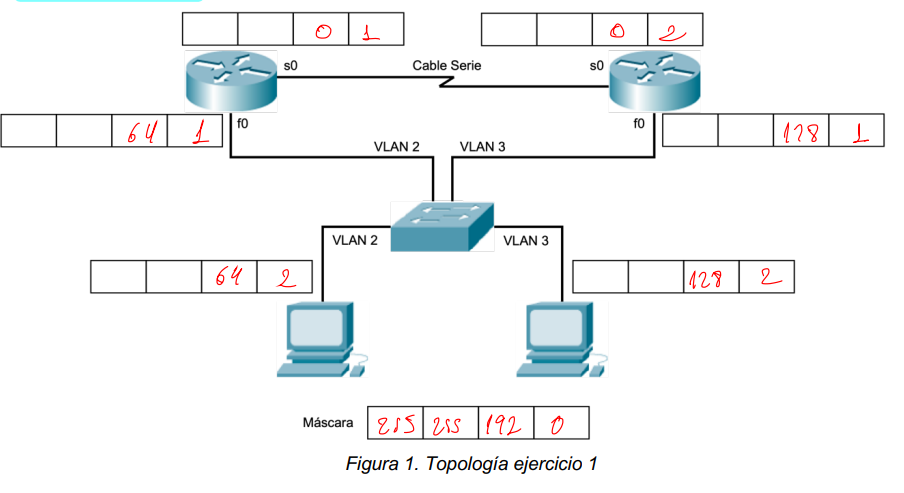
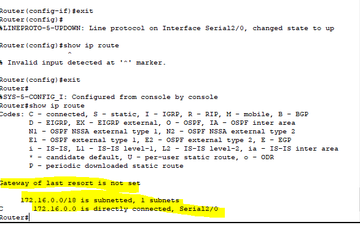

# Configuración de Router


## Reestrablecer
```bash
Router# erase startup-config
Router# reload
#Escribir no y luego presionar Intro.
#mostrar configuracion actual
Router# show running-config
#Copiar datos actuales a archivo de startup
Router# copy running-config startup-config
#mostrar interfaces 
Router# show ip interface brief
```
Para habilitar una interfaz del router, debemos hacer lo siguiente:
- **Dirección IPv4 y máscara de subred**: configurar la dirección IP y la
máscara de subred mediante el comando del modo de configuración de
interfaz:
ip address dirección máscara-de-subred
- **Activar la interfaz**: de manera predeterminada, las interfaces LAN y WAN
no están activadas. La interfaz se debe activar mediante el comando no
shutdown. Es como encender la interfaz. La interfaz también debe estar
conectada a otro dispositivo (un hub, un switch u otro router) para que la
capa física esté activa.
```bash
Router# configure terminal
Router(config)#
Router(config)# interface [tipo y numero ]
Router(config-íf)# ip address [Dirección IP] [Máscara]
Router(config-if)# description Enlace a Router X
Router(config-if)# no shutdown
Router(config-if)# exit
Router(config)# exit
Router#
```
Seguidamente visualizará un mensaje de confirmación, informando que la interfaz
[tipo y numero] se ha configurado correctamente y está activa. 

Este procedimiento es
válido para todo tipo de interfaces ethernet: gigabitethernet, fastethernet, etc.

Las interfaces serial son un caso particular, configurar las IPs y
deben identificarse como un Equipo Terminal de Datos (DTE) o como Equipo de
Terminación del Circuito de Datos (DCE).
-  (DCE): Un dispositivo que suministra los
servicios de temporización a otro dispositivo. Habitualmente, este
dispositivo se encuentra en el extremo del enlace que proporciona el
acceso WAN.
-  (DTE): Un dispositivo que recibe los servicios de
temporización desde otro dispositivo y se ajusta en consecuencia.
Habitualmente, este dispositivo se encuentra en el extremo del enlace del
cliente WAN o del usuario.

El estado predeterminado de las interfaces es APAGADO, es decir están
apagadas o inactivas. Para encender o activar una interfaz, se ingresa el comando ***<em style="color:#00ff00;font-size:18px">no shutdown.</em>***

Cuando resulte necesario inhabilitar administrativamente una interfaz a efectos de
mantenimiento o de diagnóstico de fallas, se utiliza el comando shutdown para
desactivarla.

Por lo general, se utilizará una velocidad de sincronización de 64000. Los
comandos para fijar la velocidad de sincronización y activar una interfaz serial son los
siguientes:
```bash
Router# configure terminal
Router(config)#
Router(config)# interface serial 0/0
Router(config-íf)# ip address [Dirección IP] [Máscara]
Router(config-if)#clock rate 64000 (solo DCE)
Router(config-if)# description Enlace a Router X
Router(config-if)# no shutdown
Router(config-if)# exit
Router(config)# exit
Router#

Router# show ip route
```

Realizar estos pasos con los dos routers.

## Configuración de switches

El switch cuando arranca, en caso de tener una configuración creada, se guarda
en una memoria llamada NVRAM.Para ver esta conf:
```bash
Switch# show startup-config
#muestra configuracion actual
Switch# show running-config
#guarda configuracion actual 
Switch#copy running-config startup-config
```

- Configuración VLAN: Dentro de configuración global podemos acceder a
este modo para configurar características de las VLAN, permite VID hasta 4095. Se accede con el comando vlan vlan-ID. El prompt será:
Switch:
```bash
Switch(config-vlan)#
```
Lo siguiente será la creación de las VLAN’s. La secuencia que seguir será:
```bash
#acceder al moddo de crear vlan
Switch# vlan database
#crear vlnan
Switch(vlan)#vlan X name VLAN_X 
```
El segundo comando lo tendremos que introducir dos veces, para crear dos VLAN’s.

 En el lugar de la X pondremos un 2 y un 3 respectivamente. Observar que creamos las VLAN desde el modo de configuración VLAN Database.     

```bash
#(Entramos en modo de configuración)
Switch#config 
# (La “Y” se corresponde con los números de puertos asignados para cada VLAN)
Switch(config)#interface fastethernet0/Y 
#(Configuramos el puerto comopuerto de acceso.)
Switch(config-if)#switchport mode access 
# (Asignamos el puerto a la VLAN X)
Switch(config-if)# switchport access vlan X

```
Se repetirán los tres últimos pasos para cada uno de los puertos. También levantaremos la VLAN 2, para esto:
```bash
Switch(config)#interface vlan X (Accedemos a la interfaz vlan X)
Switch(config-if)#no shutdown (Levantamos la vlan)
#Por último, guardaremos la configuración en la memoria del conmutador:
Switch(config)#exit
Switch#copy running-config startup-config
```
## Conclusiones
Al hacer un ping desde el pc1 al router 0 estan misma VLAN si lo permite. Al ghacer un ping desde PC0 a router 1 estan misma VLAN si lo permite. El router se comunica mediante serial con el otro router.