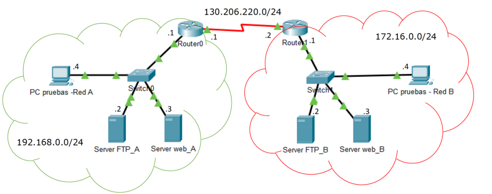
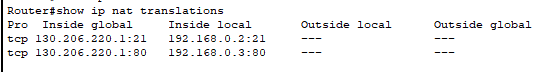
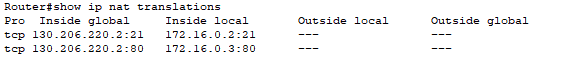
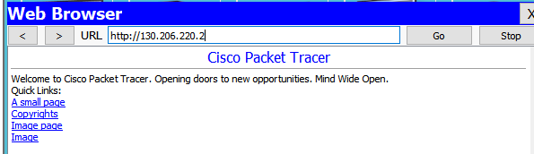

# Redes Practica 3 extra
El enlace entre los routers se realizará utilizando un cable WAN con conectores
V.35. El router de la red A será DTE y el router de la red B será DCE.

Para seleccionar el router y el switch que se debe utilizar en esta práctica, debéis
ir al submenú de dispositivos, seleccionar la carpeta y elegir el router 2811 (de la
derecha) y el switch 2960.



Para establecer las rutas estáticas entre routers se deberá indicar en cada router
como llegar a la red que desconoce.

 Por ejemplo, al router 0 se le deberá indicar que
para llegar a la red 172.16.0.0 se debe salir por la interfaz serial al siguiente salto
130.206.220.2.

 Lo mismo, pero en sentido contrario se deberá hacer con el router 1.
```bash
Router(config)#ip route [red_destino] [mask] [IP_siguiente_salto]
```

# Configuración del PAT estático
## Tareas a realizar para la red A.
La traducción se realiza manualmente, una para cada puerto y para cada IP que queramos a utilizar. Es utilizado para que servidores de la red interna (red privada) sean visibles en Internet (red pública). 

Únicamente se tendrá acceso al puerto del servidor
sobre el cual se ha realizado la traducción, pero no al resto de puertos. La asignación es permanente. 

Para crear la tabla de asignaciones utilizamos el mismo comando
utilizado para realizar las asignaciones NAT estáticas, pero utilizando la opción de indicar tanto el puerto público como el privado, indicando si se trata de un puerto TCP o UDP:
```bash
Router(config)#ip nat inside source static {TCP|UDP} [IP_local][Puerto_local] [IP_global] [Puerto_global]
```

Por ejemplo, si tenemos:
- Red Privada: 192.168.0.0 con máscara de red 255.255.255.0
- IP Privada del Router (GigabitEthenet 0/0): 192.168.0.1/24
- IP Pública del Router (Serial 0/1/0): 130.206.220.1/24
- IP Servidor web: 192.168.0.3/24
- IP Servidor ftp: 192.168.0.2/24

Ambos servidores, http y FTP sean accesibles desde Internet, pero
que únicamente se pueda acceder a los puertos 80 y 21  respectivamente, de estos.Creamos dos entradas estáticas en la tabla PAT:
```bash
Router(config)#ip nat inside source static tcp 192.168.0.2 21 130.206.220.1 21
Router(config)#ip nat inside source static tcp 192.168.0.3 80 130.206.220.1 80
```
En este caso, y normalmente será así, el puerto local coincide con el puerto global,ya que deseamos que las peticiones al puerto 80 o 21 de la dirección IP pública sean desviadas a los mismos puertos 80 y 21 respectivamente, pero de direcciones IP
privadas.

Como en el caso del NAT deberemos indicar que interfaz pertenece a la ‘parte local’ de la red y que interfaz pertenece a la ‘parte global’:
```bash
Router(config)#interface fastethernet 0/0
Router(config-if)#ip nat inside
Router(config-if)#interface Serial 0/0/0
Router(config-if)#ip nat outside
```


PAT estático suele configurarse en los routers con conexión a Internet, como por ejemplo con ADSL o RDSI, para dar acceso desde Internet a los puertos y direcciones IP concretos de los servidores de la red local que se desea que sean públicos.

En cambio, **no sería lógico utilizar PAT estático para que los clientes de la red local accedan
a Internet**
## Tareas a realizar para la red B.
```bash
Router(config)#ip nat inside source static {TCP|UDP} [IP_local][Puerto_local] [IP_global] [Puerto_global]
```
Por ejemplo, si tenemos:
- Red Privada: 172.16.0.0 con máscara de red 255.255.255.0
- IP Privada del Router (GigabitEthernet 0/0): 172.16.0.1/24
- IP Pública del Router (Serial 0/1/0): 130.206.220.2/24
- IP Servidor web: 172.16.0.3/24
- IP Servidor ftp: 172.16.0.2/24

```bash
Router(config)#ip nat inside source static tcp 172.16.0.3 80 130.206.220.2 80
Router(config)#ip nat inside source static tcp 172.16.0.2 21 130.206.220.2 21
Router(config)#interface fastethernet 0/0
Router(config-if)#ip nat inside
Router(config-if)#interface Serial 0/0/0
Router(config-if)#ip nat outside
Router#show ip nat translations 
```

Desde el PC de la red A, abrir el Web Browser y hacer una búsqueda de la dirección 130.206.220.2


# Configuración del PAT dinámico.
## Tareas a realizar para la red A.

En este caso la traducción entre dirección IP y puerto privados por dirección y
puerto públicos se realiza de forma dinámica, es decir, según se va necesitando. Cada vez que se inicia una conexión TCP/IP Cliente – Servidor, se creará una nueva entrada en la tabla PAT de forma dinámica. 

PAT Dinámico se utiliza para dar acceso a toda una red Privada a Internet utilizando únicamente unas pocas direcciones públicas, o incluso
una única dirección IP pública. Por tanto, traduciremos:

1. Dirección IP y puerto Origen cuando el tráfico es desde el interior de la red
Privada a Internet.
2. Dirección IP y puerto Destino cuando el tráfico es desde Internet hacia la red Privada.

La forma de configurar PAT dinámico es idéntica a la configuración de NAT
dinámico, pero añadiéndole la opción OVERLOAD al crear la tabla PAT:

1º Paso: Definimos la tabla con el rango de direcciones públicas disponibles:
```bash
Router(config)#ip nat pool Nombre_tabla [IP_inicial] [IP_global] netmask
[mascara de red]
```
2º Paso: Creamos una ACL indicando quien podrá utilizar la tabla PAT, es decir,
quien podrá abrir nuevas entradas dinámicas en la tabla:
```bash
Router(config)#access-list [numero_ACL] permit [IP] [wildcard]
```
3º Paso: Creamos la tabla NAT dinámica asociando la tabla con las direcciones
públicas a la lista de acceso con las direcciones privadas y le añadimos la opción **OVERLOAD** para indicar que queremos hacer PAT, traducción de direcciones de puerto:
```bash
Router(config)#ip nat inside source list [Numero_ACL] pool [Nombre_tabla]OVERLOAD
```
4º Paso: Como siempre asignamos los interfaces LOCAL y GLOBAL:
```bash
Router(config)#interface ethernet 0/0
Router(config-if)#ip nat inside
Router(config-if)#interface Serial 0/0/0
Router(config-if)#ip nat outside
```
En nuestro caso, si queremos dar acceso a todos los equipos dentro de la red
local 192.168.0.0/24 a Internet, y disponemos únicamente de la dirección IP pública 130.206.220.1/24, tendremos la siguiente configuración:
```bash
Router(config)#ip nat pool MiTabla 130.206.220.1 130.206.220.1 netmask 255.255.255.0
Router(config)#access-list 1 permit 192.168.0.0 0.0.0.255
Router(config)#ip nat inside source list 1 pool MiTabla overload
Router(config)#interface fastethernet 0/0
Router(config-if)#ip nat inside
Router(config-if)#interface Serial 0/0/0
Router(config-if)#ip nat outside
```
Comprobar que no se puede acceder desde la red interna al servidor web
que hay situado en la otra red. Esto es debido a que el router no redirecciona el puerto 80 a una dirección IP de un equipo de su LAN. Hacer la comprobación en
ambos sentidos.

Comandos de interes 
- **clear ip nat translation** *
Elimina todas las entradas de traducción
dinámica de direcciones de la tabla de
traducción NAT.
- clear ip nat translation inside global-ip
local-ip [outside local-ip global-ip]: 
Elimina una entrada de traducción dinámica
simple que contiene una traducción interna o
una traducción interna y una externa.
- global-ip global-port local-ip local-port
[outside local-ip local port global-ip globalport]:  
Elimina una entrada de traducción dinámica
extendida.
clear ip nat translation protocol inside
