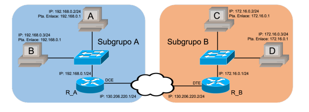

# Practica 3
Tal y como se ha visto en la teoría, las direcciones IPv4 se pueden dividir en dos
grupos: direcciones IP privadas y públicas.

La traducción de direcciones de red (NAT) se traducen direcciones IP privadas
por públicas, una a una. Es decir, a cada dirección IP privada se le hace corresponder una IP pública.

 A partir de la asignación se puede utilizar dicha dirección para establecer
cualquier aplicación, independientemente del puerto de capa 4.

Configurar un router Cisco Systems en los
siguientes casos:
- Ejecución de la traducción de direcciones de red (NAT) para convertir las
direcciones IP internas (en nuestro caso direcciones privadas), en
direcciones públicas externas. Configurar el mapeo IP estático para
permitir el acceso externo a un PC interno.
- Uso de la traducción de direcciones de puerto (PAT) para convertir las
direcciones IP internas (en nuestro caso direcciones privadas), en una
dirección pública externa. Configurar el mapeo IP dinámico para permitir el
acceso externo a una red de PCs interna.
- Probar la configuración y verificar las estadísticas de NAT/PAT

1. Configuración de direcciones IP privadas y puertas de enlace en los hosts.
2. Los conmutadores no deberán tener ninguna configuración previa.
3. Configurar el router para que, utilizando NAT o PAT, nos permita el acceso
al exterior de nuestra red.
4. Realizar pruebas para comprobar que todo funciona correctamente.
5. Restaurar las conexiones y direccionamiento IP de los hosts del laboratorio
para dejarlo a disposición de los compañeros que utilicen el laboratorio
después que nosotros


## Configuración de las IPs del router.
```bash
#PARA LOS 2 Routers
Router# erase startup-config
Router# reload
```
Configurar cada una de las interfaces. El interfaz RJ-45
puede ser una ethernet (con lo cual será ethernet 0) o Fastethernet (con lo cual será fastethernet 0). En el caso de tener un interfaz Serial WAN DB60 o Smart (será serial0 ). Podría ocurrir que estuviéramos ante un interfaz que permite varios interfaces, por lo que tendríamos Serial 0/0, Serial 0/1, etc.
Entramos en la interfaz fastethernet 0 que es la que corresponde a la interfaz LAN.
```bash
###########
#SUBGRUPO A
###########
R_A(config)# interface fastethernet 0/0
R_A(config-if)# ip address 192.168.0.1 255.255.255.0
R_A(config-if)# no shutdown
R_A(config-if)# exit
###########
#SUBGRUPO B
###########
R_B(config)# interface fastethernet 0/0
R_B(config-if)# ip address 172.16.0.1 255.255.255.0
R_B(config-if)# no shutdown
R_B(config-if)# exit
```
Pasamos a la interfaz serial 0 para configurar la IP WAN. Configuramos la
dirección IP de la interfaz, indicamos que este interfaz es el que marca la señal de reloj (clock rate 64000) y la habilitamos, ya que por defecto está deshabilitada.
```bash
###########
#SUBGRUPO A
###########
R_A(config)# interface serial 0/0/0
R_A(config-if)# ip address 130.206.220.1 255.255.255.0
R_A(config-if)# clock rate 64000
R_A(config-if)# no shutdown
R_A(config-if)#exit
R_A(config)#exit
R_B(config)# ip route 0.0.0.0 0.0.0.0 Serial 2/0
Router# copy running-config startup-config

###########
#SUBGRUPO B
###########
R_B(config)# interface serial 0/0/0
R_B(config-if)# ip address 130.206.220.2 255.255.255.0
R_B(config-if)# no shutdown
R_B(config-if)#exit
R_B(config)#exit
R_B(config)# ip route 0.0.0.0 0.0.0.0 Serial 2/0
Router# copy running-config startup-config

```
El ordenador puede realizar un ping a la dirección IP del
interfaz del router y que el router puede realizar un ping a la dirección IP del interfaz del router vecino.

## Configuración del NAT estático.
A traducción de una dirección pública por
una dirección privada


La traducción se realiza de forma manual (administrativamente) y por tanto es
permanente. 

La red Ethernet es una red local privada y por tanto las direcciones IP no
son visibles en Internet. Cuando configuramos NAT a las direcciones privadas se les
denomina direcciones locales.

 En el interface Serial tenemos configurado una dirección IP Pública que sí es visible en Internet. Está dirección nos la ha asignado nuestro ISP. Las direcciones Públicas son denominadas por NAT como direcciones
globales.

Configuramos NAT estático de forma que un equipo de la red privada (solamente
uno y siempre el mismo) pueda acceder a Internet. Tendrá acceso a cualquier servicio
y también desde Internet se tendrá acceso al equipo a cualquier servicio
```bash
Router(config)# ip nat inside source static [IP_local] [IP_global]
###########
#SUBGRUPO A
###########
R_A(config)# ip nat inside source static 192.168.0.2 130.206.220.1
```
Para el subgrupo A hemos elegido el equipo 192.168.0.2 de la red local para
acceder a Internet. Para cualquier tráfico generado por este equipo en Internet, parecerá
que proviene de la dirección IP 130.206.220.1,
```bash
Router(config)# ip nat inside source static [IP_local] [IP_global]
###########
#SUBGRUPO B
###########
R_B(config)# ip nat inside source static 172.16.0.2 130.206.220.2
```
Para el subgrupo B hemos elegido el equipo 172.16.0.2 de la red
local para acceder a Internet. Para cualquier tráfico generado por este equipo en
Internet, parecerá que proviene de la dirección IP 130.206.220.2
```bash
###########
#Para 2 SUBGRUPOS  por igual
###########
Router(config)# interface Fastethernet 0/0
Router(config-if)# ip nat inside
Router(config-if)# exit
Router(config)#interface Serial 0/0/0
Router(config-if)#ip nat outside
```
- Subgrupo A: Para comprobar que la traducción se ha realizado correctamente,
realizaremos un ping a la dirección IP del interfaz WAN del router del grupo B.
- Subgrupo B: Para comprobar que la traducción se ha realizado correctamente,
realizaremos un ping a la dirección IP del interfaz WAN del router del grupo A.
```bash
Router#show ip nat translation
```
## Configuración del NAT dinámico.

Traducción de una dirección IP pública por una dirección IP privada. La
traducción se hace solo cuando se solicita y tiene una validez temporal (permanecerá en la tabla NAT )
la asignación solo dura un periodo de tiempo determinado y
cuando caduca se asigna a otro equipo.

Con lo cual podrán acceder a Internet varios equipos de la red privada, pero eso sí, de uno en uno (en el caso de disponer de una única dirección IP pública, que es lo habitual en un entorno doméstico o de pequeña empresa).
Como primer paso previo, si no lo hemos realizado aún, debemos desactivar la configuración de NAT estático.
```bash
Router (config)# no ip nat inside source static [IP_local] [IP_global]
```
1. Definir una tabla con el rango de direcciones públicas de que
disponemos

```bash
Router(config)#ip nat pool Nombre_tabla [IP_inicial] [IP_global] netmask
[mascara de red]

Router(config)#ip nat pool MiTabla 130.206.220.10 130.206.220.20 netmask
255.255.255.0
```
Si disponemos de una única dirección IP pública, por ejemplo, de la dirección
IP 130.206.220.1, como en el ejemplo de NAT estático, tendríamos que poner:
```bash
###########
#SUBGRUPO A
###########
R_A(config)#ip nat pool MiTabla 130.206.220.1 130.206.220.1 netmask
255.255.255.0
```
Si disponemos de una única dirección IP pública, por ejemplo de la dirección
IP 130.206.220.2, como en el ejemplo de NAT estático, tendríamos que poner:
```bash
###########
#SUBGRUPO B
###########
R_B(config)#ip nat pool MiTabla 130.206.220.2 130.206.220.2 netmask
255.255.255.0
```
2. Definir que equipos de la red privada (que direcciones IP de esta red) son
los que pueden hacer uso del NAT
```bash
Router(config)#access-list [numero_ACL] permit [IP] [wildcard
```
Por ejemplo, si queremos que tenga acceso toda la red local ethernet con
dirección de red 192.168.0.0 con máscara de red 255.255.255.0:
```bash
###########
#SUBGRUPO A
###########
R_A(config)#access-list 1 permit 192.168.0.0 0.0.0.255
```
Por ejemplo, si queremos que tenga acceso toda la red local ethernet con
dirección de red 172.16.0.0 con máscara de red 255.255.255.0:
```bash
###########
#SUBGRUPO B
###########
R_B(config)#access-list 1 permit 172.16.0.0 0.0.0.255
```
3. Creamos la Tabla NAT dinámica asociando la tabla de direcciones
públicas disponibles con la lista de acceso que las va a utilizar.

```bash
###########
#SUBGRUPO A/B
###########
Router(config)# ip nat inside source list 1 pool MiTabla
```
4. Determinar qué interface está conectado a la red privada (o red local) y
que interface está conectado a la parte exterior o global (red pública) del
router. De igual manera, las interfaces públicas y privadas se configuran igual
para ambos subgrupos.
```bash
###########
#SUBGRUPO A/B
###########
Router(config)#interface fastethernet 0/0
Router(config-if)#ip nat inside
Router(config-if)#interface Serial 0/0/0
Router(config-if)#ip nat outside
```

Cuando ejecutemos el comando de monitorización de la tabla NAT:
```bash
###########
#SUBGRUPO A/B
###########
Router#show ip nat translation
```
Veremos entradas dinámicas de las traducciones, según los clientes (los equipos
de la red privada) las van solicitando. Si no sale ninguna entrada, deberemos realizar un ping para que aparezca una entrada dinámica en la tabla de NAT. 
Sólo los equipos de la red privada tienen permiso por la lista de acceso para crear la entrada NAT.

 Desde Internet no se puede crear una entrada dinámica. Pero una vez
stablecida dicha entrada (dicha traducción entre IP pública e IP Privada) desde Internet se tendrá acceso completo (a todos los puertos que tenga abiertos) al equipo de la redprivada.


El timeout por defecto, es decir, el tiempo que permanece una entrada en la tabla
dinámica, es de 24 horas. Así que si queremos agilizar los cambios en la tabla
deberemos reducir este tiempo con el comando:
```bash
###########
#SUBGRUPO A/B
###########
Router(config)#ip nat translation timeout [valor_en_seg]
```
Comprobar que los PCs configurados en modo monopuesto de ambas redes
responden ante un ping.