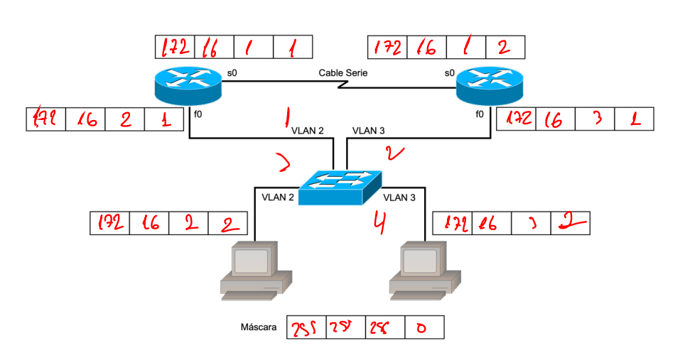
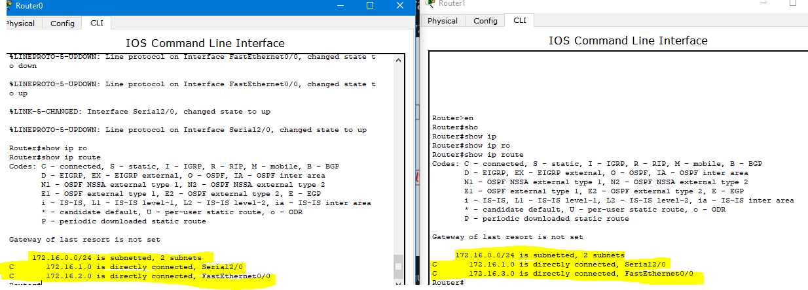

# Configuración del protocolo de enrutamiento RIP con routers Cisco

En los protocolos de enrutamiento dinámico, los nodos eligen donde enviar los
segmentos de datos fijándose en la tabla de encaminamiento. Esta tabla se actualiza
según la información enviada periódicamente por cada protocolo dinámico. Existen dos
tipos de protocolos dinámicos, los basados en vector-distancia como el RIP y los
basados en estado-de-enlace como OSPF.
Basados en vector-distancia envían dos informaciones a sus vecinos:
- La distancia en saltos para alcanzar una red.
- La dirección que tomar para llegar.

Los basados en estado-de-enlace consiguen un mapa de la topología de la red intercambiando información con los nodos vecinos

# RIP 
Es un protocolo que se diseñó para ser usado dentro de
un dominio y en redes pequeñas. Su limitación principal es que como mucho acepta **15 saltos** cosa que imposibilita la creación de redes grandes. Además, las rutas son elegidas según el número de saltos y no por su ancho de banda

## Configuración del protocolo de enrutamiento RIP
Subred IP: 172.16.X.0 255.255.255.0 X=1, 2 y 3


Borrar configuracion de router actual 
```bash
Router# erase startup-config
Router# reload
```
Una vez que ambos routers de la topología mostrada en la Figura 1 están listos, el siguiente paso es configurar la red. Tal y como se puede observar la red está formada por **dos routers y un switch configurado con 2 VLANs**. El propio
grupo elegirá qué router es DTE o DCE, y tras ello deberá indicarlo en la figura. 

El clockrate será 64000. Una vez se hayan puesto las direcciones IP a cada uno de los dispositivos, también deberán indicarse en la figura (las direcciones IP son las indicadas
en el apartado anterior). 

En la última parte de la práctica, testearemos que existe
conectividad (hacer un ping) entre el ordenador y el router de la VLAN 2, entre los 2 routers y entre el router y el ordenador de la VLAN 3.


```bash
Router# show ip route
```
Para configurar RIP tenemos que entrar en modo privilegiado, después en modo configuración global y escribir:
```bash
Router(config)# router rip
```
También tenemos que definir cuáles son las redes directamente
conectadas que queremos que sean notificadas por RIP a otros nodos.
```bash
#ip-de-la red --> 172.16.0.0 (no vale una ip de subred)
Router(config-router)# network 172.16.0.0
Router# show running-config
Router# copy startup-config running-config
Router# show ip protocols

```
En este caso sólo definiremos la red 172.16.0.0 pues abarca todas las subredes.z

La notificación se realiza con broadcast por las interfaces de esas redes. 

Si queremos ver las tablas de enrutamiento y comprobar si se ha añadido alguna entrada gracias al RIP debemos ejecutar
```bash
Router# show ip route
```
Realiza pings desde el PC y el router a todos las IP de la red para comprobar que funciona el encaminamiento dinámico.

Y utiliza el “tracert” para ver las rutas que siguen
los paquetes. Veamos cómo se envían las tablas de actualización los routers cuando
ejecutan el protocolo de enrutamiento RIP. Para ello ejecutar:
```bash
Router# debug ip rip
```

