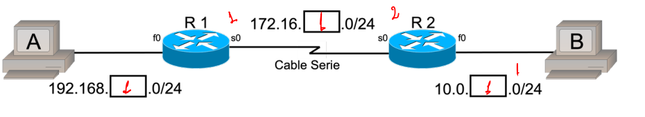
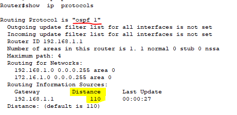

# Enrutamiento con OSPF routers Cisco

OSPF (Protocolo de encaminamiento Primero la ruta libre más corta) se desarrolló
como respuesta a la incapacidad de RIP de dar servicio a redes de gran tamaño, esta basado en el estado de los enlaces de los routers que comprenden la topología

Los enrutadores OSPF mantienen un "mapa" de la red que se actualiza después de cada cambio en la
topología de la red. Este mapa se llama base de datos del estado de los enlaces. 

La base de datos del estado de los enlaces se utiliza para calcular las rutas de red, que
deben volver a calcularse después de que haya un cambio en la topología.

Si aumenta el tamaño de la base de datos del estado de los enlaces, los requisitos de memoria y los tiempos de cálculo de rutas de los routers aumentan considerablemente. **Para solucionar este problema, OSPF permite dividir la red en muchas áreas conectadas entre sí mediante un área troncal (área 0)**

# Configuración del protocolo de enrutamiento OSPF

Donde el primer grupo utilizará X=1, el segundo grupo X=2 y así
sucesivamente. Una vez se hayan puesto las direcciones IP a cada uno de los dispositivos, escribirlo en la figura. El propio grupo elegirá qué router es DTE o DCE, tras ello, deberá indicarlo en la figura.

El clockrate debe ser 56 kbps. **No debe haber
ningún switch entre los dos ordenadores.**

Ping entre:
- Entre el ordenador A y el router R1
- Entre el router R1 y el router R2
- Entre el ordenador B y el router R2

Pasemos a ver las redes que tiene el router directamente conectadas con:
```bash
Router# show ip route
```
Para configurar OSPF tenemos que entrar en modo privilegiado, después en modo configuración global y escribir:

```bash
Router(config)# router ospf 1
```
El número 1 es el número de proceso OSPF. Esto habilita el proceso OSPF en el router y cambia el estado de la línea de órdenes

 Ahora debemos añadir sólo las redes que deseamos que sean enrutadas con el protocolo de enrutamiento OSPF. Añadiremos todas estas redes al área 0.
```bash
Router(config-router)# network 192.168.X.0 0.0.0.255 area 0
Router(config-router)# network 172.16.Y.0 0.0.0.255 area 0
```
Esta configuración correspondería al Router 1 (router 0 cisco) de la topología, donde X e Y dependerán de las IP seleccionadas según el grupo.




